# Complex Impedance Measurement Instrument

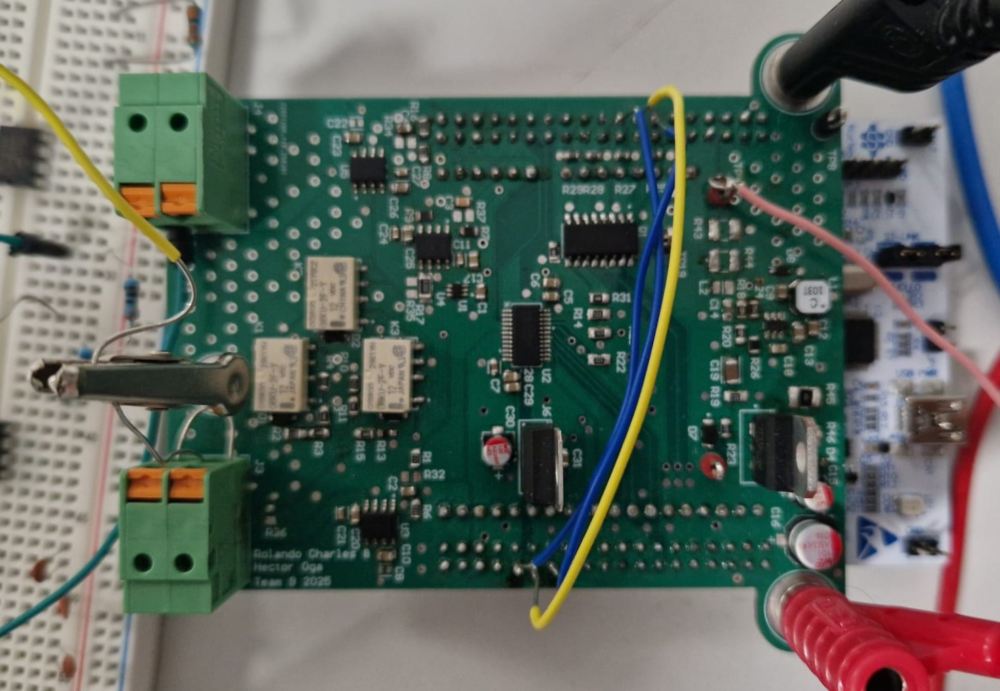

> Accurate, affordable, and modular impedance measurement solution with sub-1% error — designed and built from scratch using STM32 and custom analog front-ends.

## Overview

This project implements a precision impedance measurement instrument capable of characterizing complex impedances over wide frequency (1 kHz – 2 MHz) and impedance (10 Ω – 1 MΩ) ranges with better than 1% error. It is built using a single-frontend (IV method) architecture, a Python-based GUI, and STM32-based embedded firmware. The instrument performs magnitude/phase measurements, computes fitted RLC parameters, and outputs Bode plots and Q-factors.

Originally designed and developed as part of the ELEC60018 Instrumentation course at Imperial College London, this project was a collaborative effort between [Rolando Charles](https://github.com/rolandocharles) and [Hector Oga](https://github.com/ogahector).

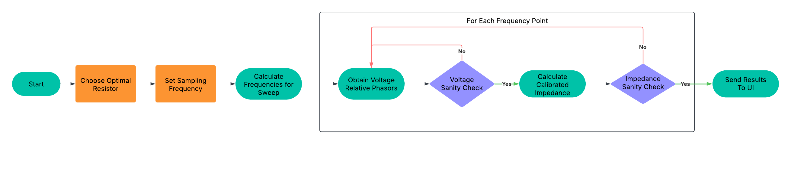

---

## Motivation

Measurement and analysis of electrical impedance are fundamental in electronics, materials science, and biomedical instrumentation. Commercial instruments are either prohibitively expensive or limited in configurability. Our goal was to design a custom, cost-effective impedance analyzer that:

- Achieves sub-1% accuracy across a broad operating range
- Uses accessible hardware (STM32, external ADC, discrete AFE components)
- Features a user-friendly GUI for visualization and data export
- Is fully self-contained and portable

---

## System Architecture

### Hardware Block Diagram

The system consists of:

- An analog front-end (AFE) implementing the IV method
- STM32 MCU generating DAC waveforms and collecting ADC samples
- Precision ADC (ADS7863) for simultaneous dual-channel sampling
- UART-based full-duplex communication to host PC
- Relay-based switching for multiple reference resistors
- Differential current sensing using INA190 for redundancy
- Isolated PDN with ultra-low-noise regulators
- Separated Digital and Analogue grounds with single connection point for noise isolation
- Stitching vias for RF high-frequency interference isolation

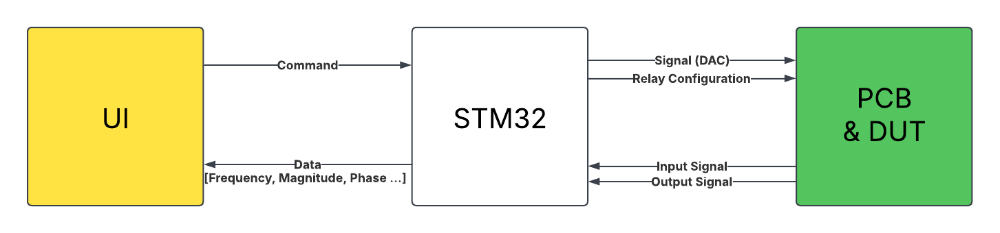

---

## Analog Front-End (AFE) Design

The chosen measurement topology uses a single IV AFE, consisting of:

- **Signal Source:** A buffered DAC output producing sinusoidal waveforms
- **Voltage Measurement Buffers:** High-impedance OPA810 op-amps feeding ADCs
- **Reference Resistor Network:** Relay-switched resistors (100 Ω, 1 kΩ, 10 kΩ, 100 kΩ) for dynamic impedance matching
- **Current Sensing:** High-side shunt resistor + INA190 precision amplifier
- **Buffers and Passive Filtering:** To ensure phase accuracy and reduce loading

---

## Power Delivery Network (PDN)

A single +12V supply is used to generate:

- ±12V analog rails (via LT8330 inverting switch-mode converter)
- +3.3V digital rail (via LD1117 linear regulator)
- Capacitive multipliers and ferrite chokes to suppress ripple

Noise performance is simulated and measured to be < 5 nV/√Hz for the analog supply rails, ensuring high SNR for all analog signal paths.

---

## Firmware & Embedded System

Written for STM32F446RE (ARM Cortex-M4), the firmware manages:

- DAC waveform synthesis via DMA
- Dual-channel ADC sampling via DMA
- UART communication with non-blocking interrupt routines
- Calibration and error correction handling
- Command parsing for sweep/fitting from host GUI

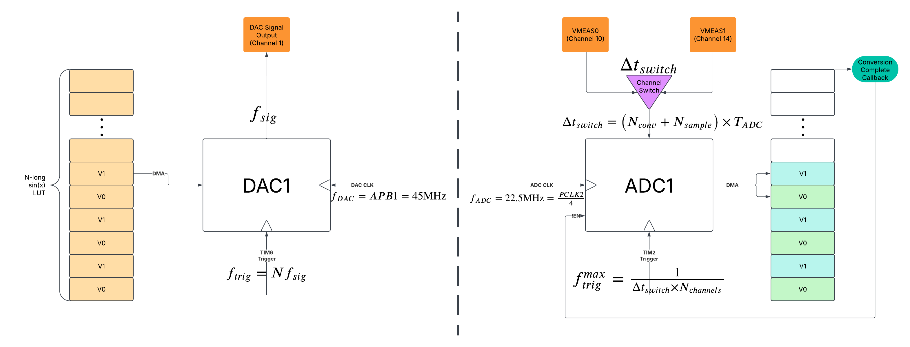

### IQ Method for Phase Measurement

We apply a digital IQ demodulation technique to extract:

- In-phase (I) and quadrature (Q) components
- Complex phasor V1 (reference) and V2 (DUT)
Raw uncalibrated DUT impedance calculated as:

```math
Zx = R_0 \times \frac{V_2}{V_1 - V_2}
```

Phase alignment corrections and group delay compensation are implemented in software.

## PC GUI (Python)

A Python-based GUI built with `matplotlib`, `numpy`, `PyQt6`, and `scipy` handles:

- UART communication with STM32
- Real-time visualization of magnitude and phase plots
- Curve fitting to RLC models using scipy.optimize.curve_fit
- Display of Q-factor, fitting error, and impedance sweep
- Export of CSV logs for all measured data

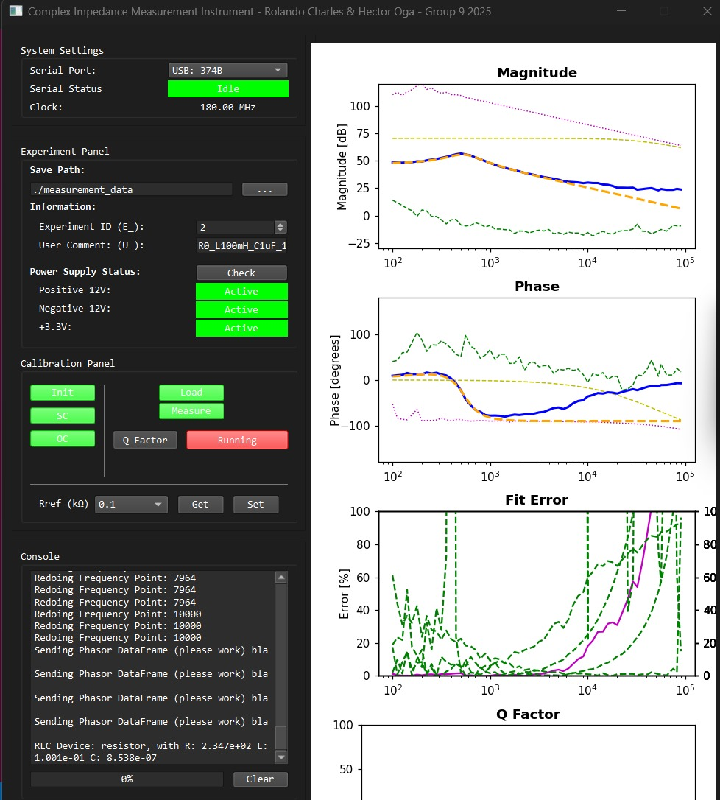

## Calibration Methodology

To correct for parasitic effects, a three-step calibration procedure is implemented:

1. Short-Circuit (SC): Characterize series resistance and inductance
2. Open-Circuit (OC): Extract parallel stray capacitance
3. Load (LD): Use known 3.162kΩ standard to compute system gain

Calibration applies the correction equation:

```math
Z_{DUT} = Z_{std} \times \frac{ (Z_{om} - Z_{stdm})(Z_{m} - Z_{sm}) }{ (Z_{stdm} - Z_{sm})(Z_{om} - Z_{m}) }
```

This ensures accurate impedance extraction across the spectrum, especially at the low and high ends where parasitics dominate.

## Performance Metrics

The instrument was evaluated with standard components. Summary of average errors:

| Component Type | Avg. Error |
| -------------- | ---------- |
| Resistors      | 0.48%      |
| Capacitors     | 2.50%      |
| Inductors      | 1.42%      |
| Series RLC     | 0.89%      |
| Parallel RLC   | 3.03%      |

Errors above 1% typically occurred at <500 kHz or for very high/low impedance DUTs, which are being addressed in future improvements.
Below are also some figure showcasing the exceptional performance of our instrument.

| Resistor Detection Performance             |  Resistor Detection Error |
| :-------------------------:|:-------------------------:|
| 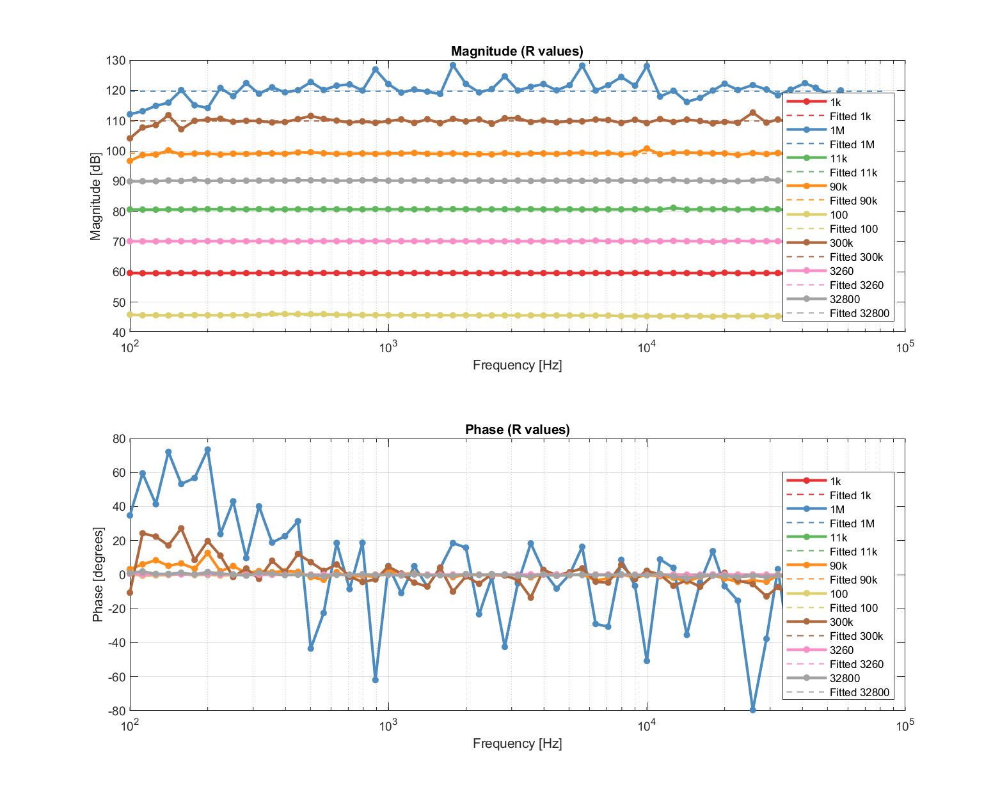  |  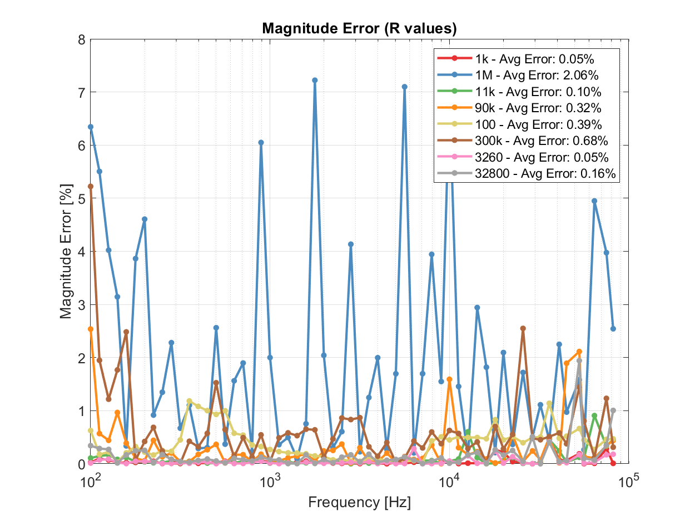 |

| Inductor Detection Performance             |  Inductor Detection Error |
| :-------------------------:|:-------------------------:|
| 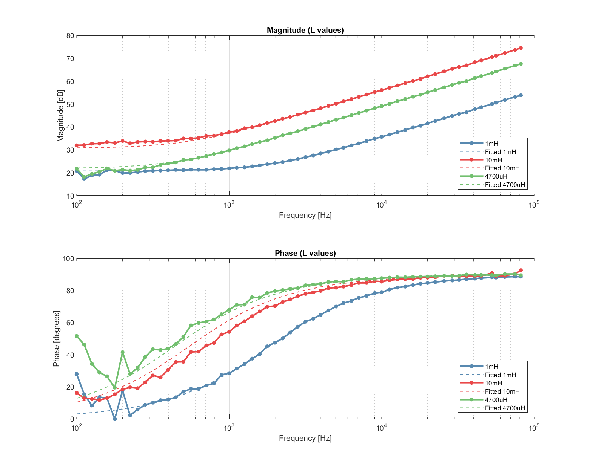  |  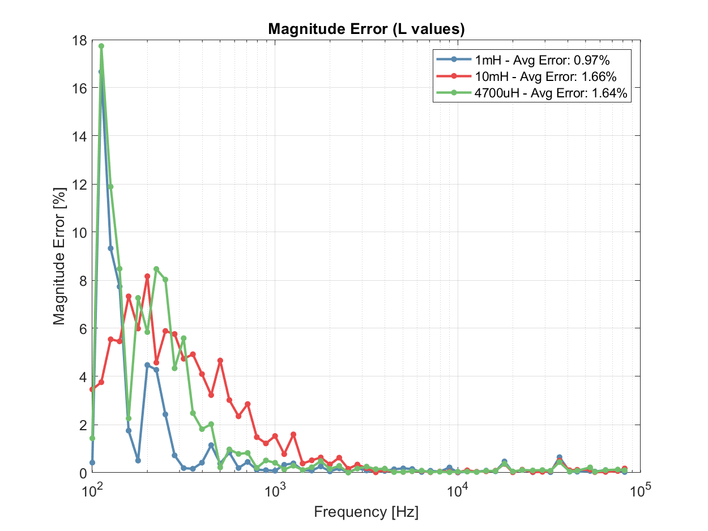 |

| Capacitor Detection Performance             |  Capacitor Detection Error |
| :-------------------------:|:-------------------------:|
| 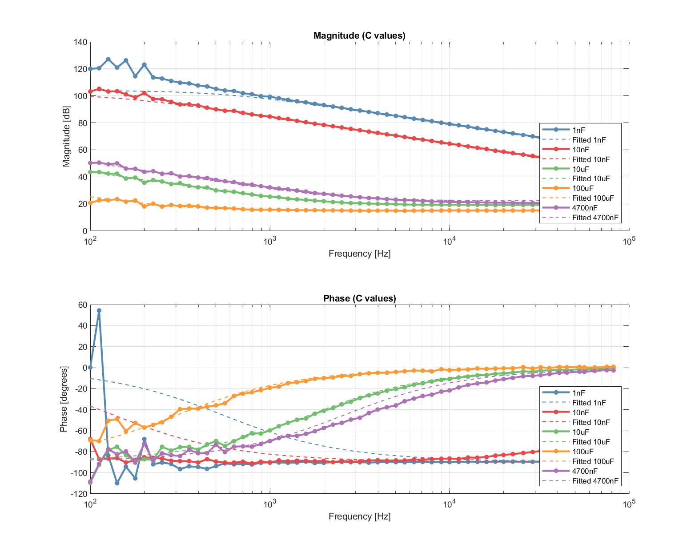  |  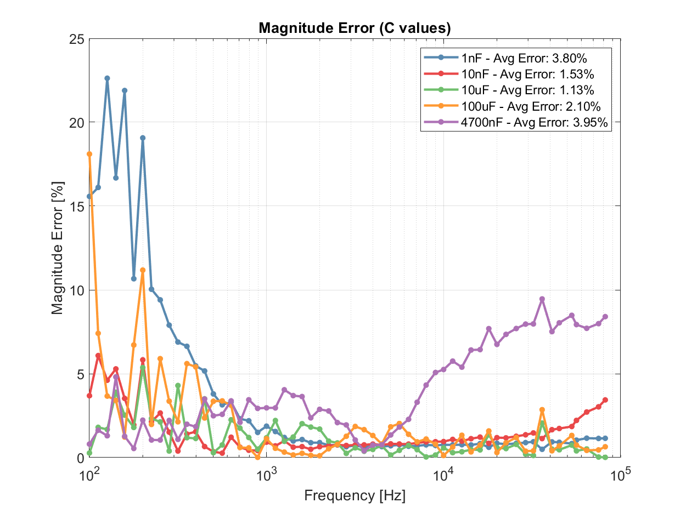 |

| Series RLC Detection Performance             |  Series RLC Detection Error |
| :-------------------------:|:-------------------------:|
| 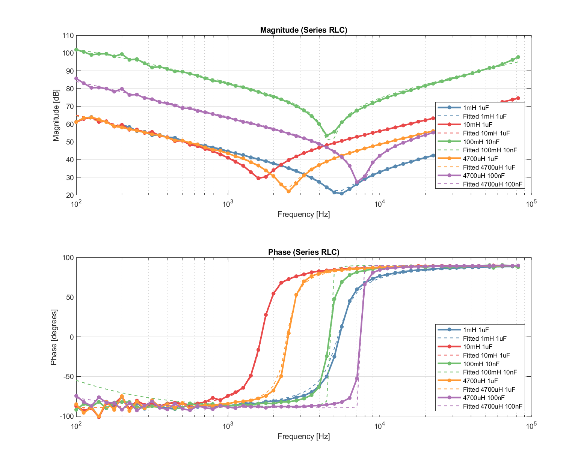  |  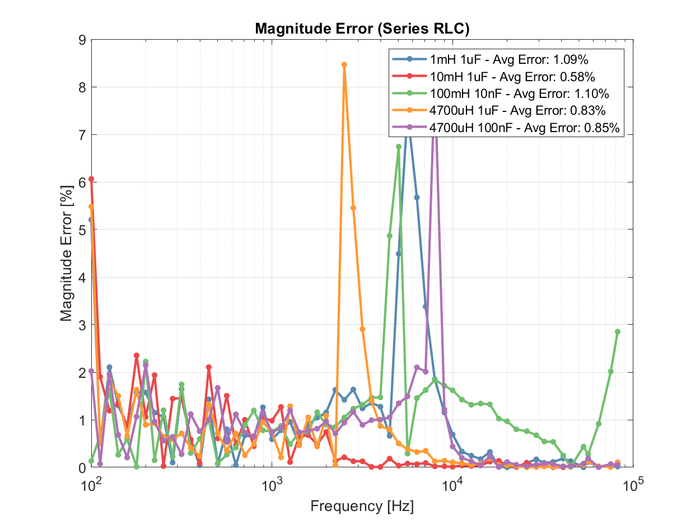 |

| Parallel RLC Detection Performance             |  Parallel RLC Detection Error |
| :-------------------------:|:-------------------------:|
| 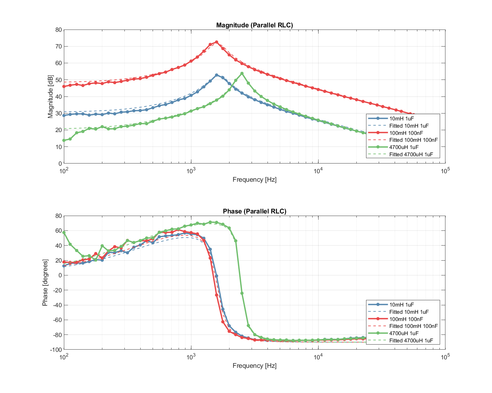  |  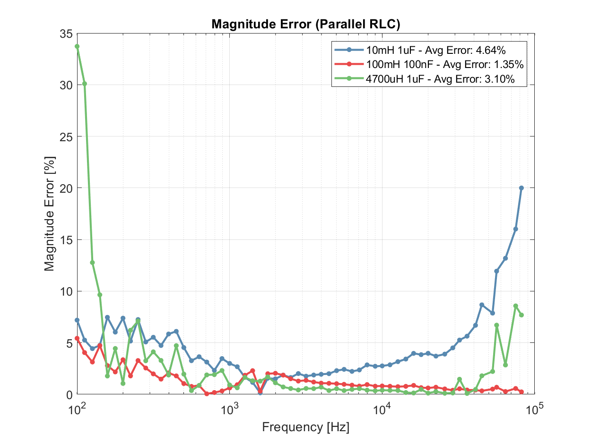 |

## Future Improvements

Several potential upgrades are planned:

- Implement adaptive reference resistor selection with analog muxes
- Add more calibration standards across the range (multi-point)
- Introduce full bare-metal implementation (register-level)
- Improve GUI to support batch testing and report generation
- Replace relay switching with solid-state analog switches for speed
- Use PCB co-axial connectors for lower parasitics in DUT interfacing

## Contributions

| Section                        | Contributor(s)   |
| ------------------------------ | ---------------- |
| Digital Circuit Design         | Hector           |
| Analog Circuit & PDN           | Rolando          |
| PCB Layout                     | Rolando & Hector |
| Firmware & DSP Algorithms      | Hector           |
| GUI and Data Visualization     | Rolando          |
| Simulation & Circuit Modelling | Hector           |
| Report Writing & Documentation | Both             |

<!-- [](https://github.com/ogahector)

[](https://github.com/ogahector)

[](https://github.com/ogahector)

[](https://github.com/ogahector) -->
